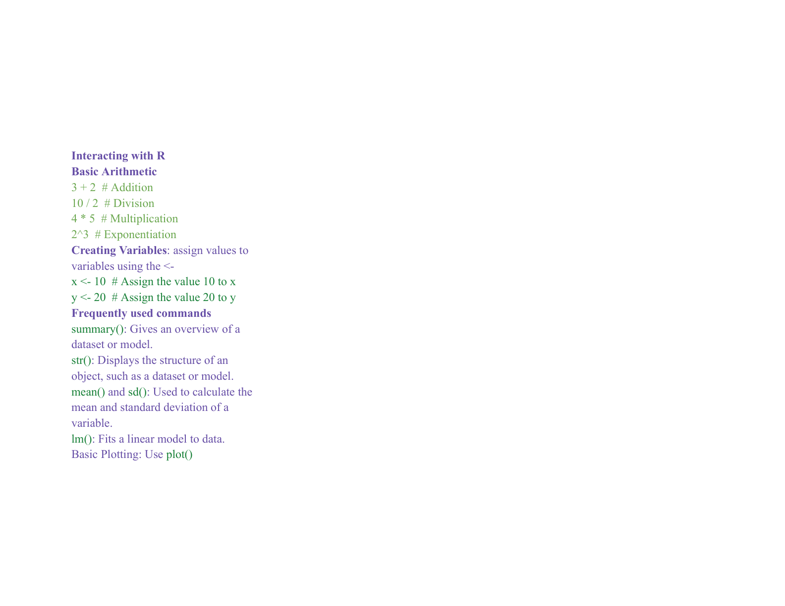
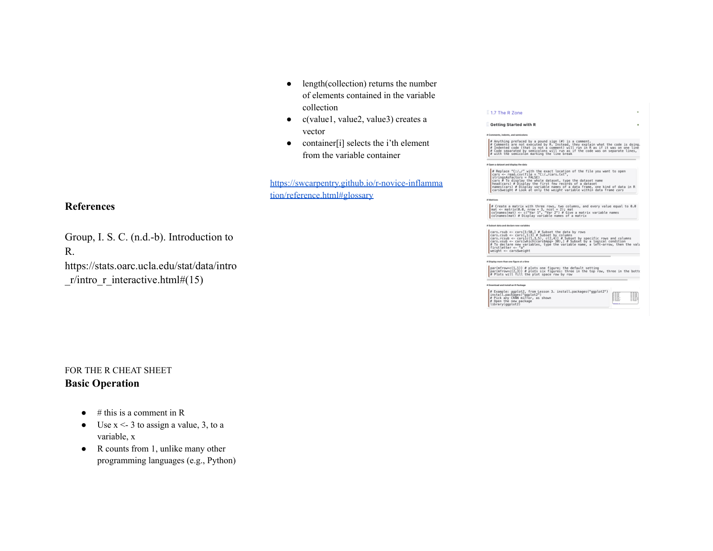
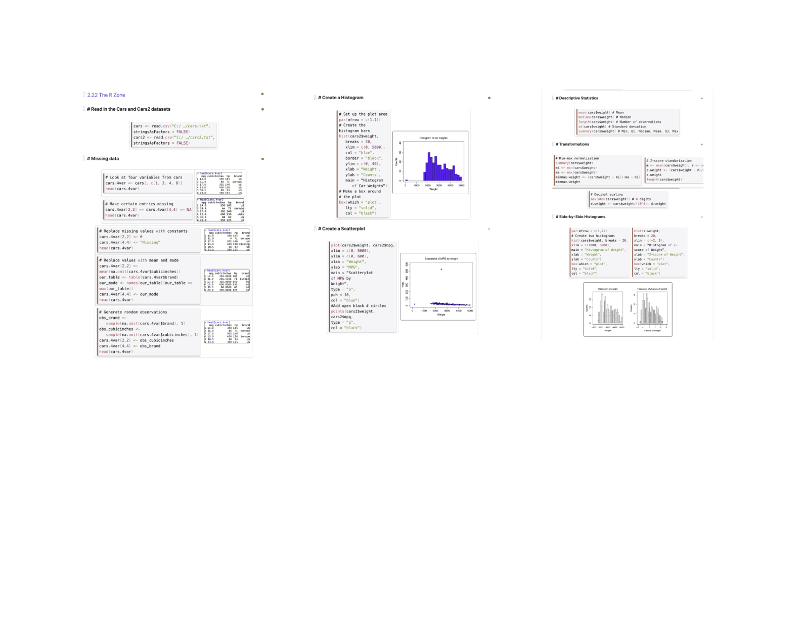
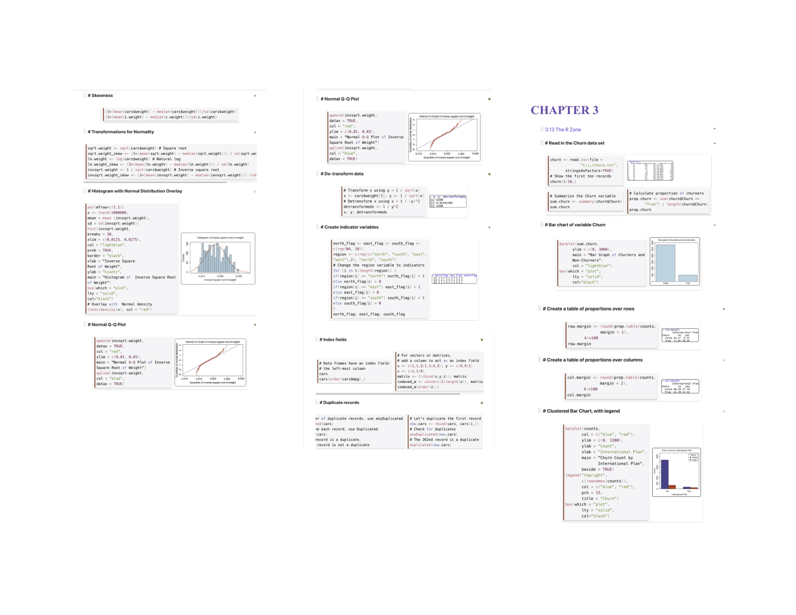
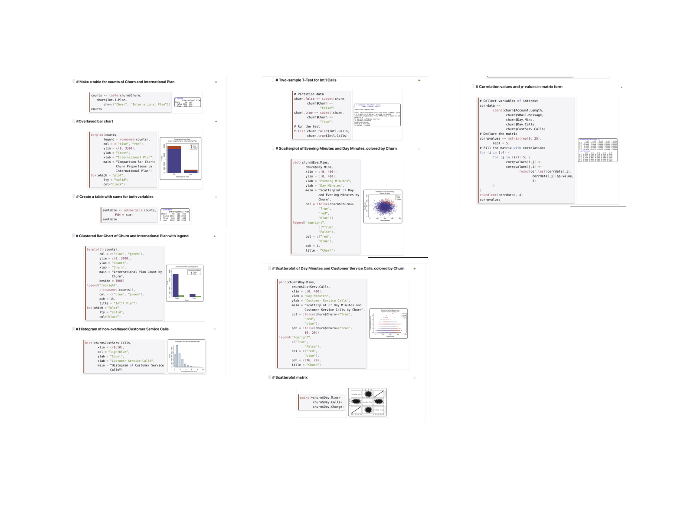
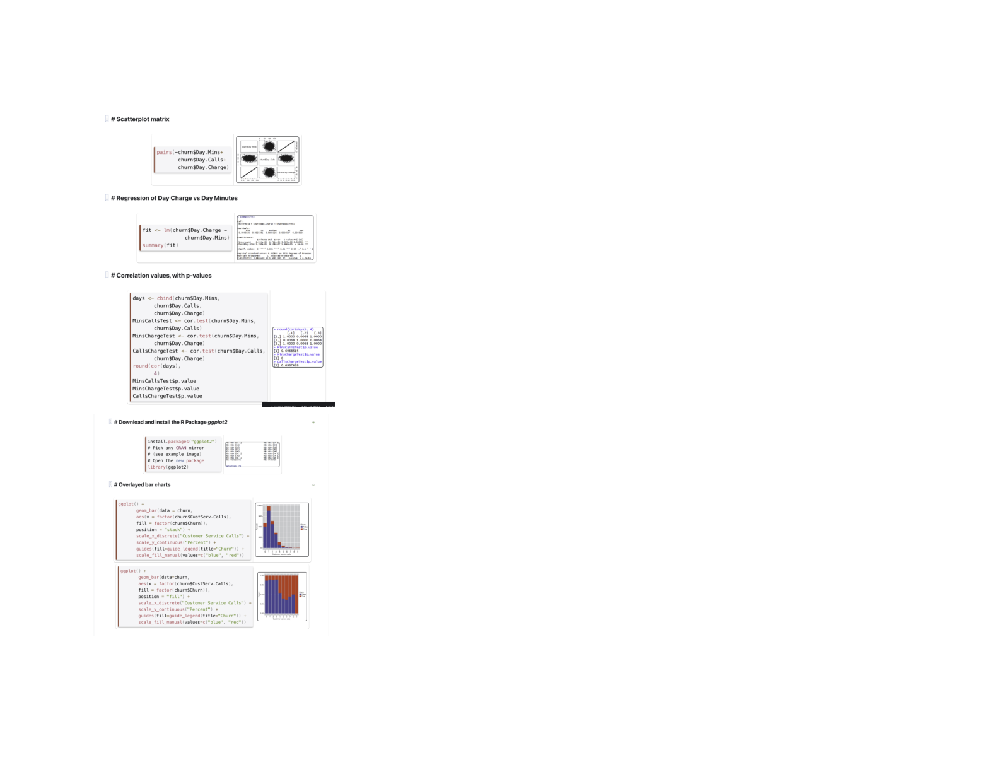

# R Reference Card

A one-pager of R/RStudio basics, data wrangling, modeling, and plotting compiled from course notes.

- 📄 **View/Download the PDF:** [`r-reference-card.pdf`](./r-refrence-card.pdf)

## Preview (pages)
<p>
  
  
  
  
  
  
  
</p>

---

## Quick commands (searchable)
```r
# Packages
install.packages("dplyr", dependencies = TRUE); library(dplyr)

# Read CSV + inspect
df <- read.csv("path/to/data.csv", stringsAsFactors = TRUE)
head(df); str(df); summary(df)

# Wrangle (dplyr)
library(dplyr)
df2 <- df |>
  filter(!is.na(x)) |>
  mutate(rate = x / y) |>
  group_by(group) |>
  summarise(n = n(), avg = mean(rate, na.rm = TRUE)) |>
  arrange(desc(avg))

# Model (linear)
m <- lm(mpg ~ wt + hp, data = mtcars)
summary(m); plot(resid(m))

# Plot (ggplot2)
library(ggplot2)
ggplot(df, aes(group, value, fill = group)) +
  geom_col() + labs(x = NULL, y = "Value") + theme_minimal()
